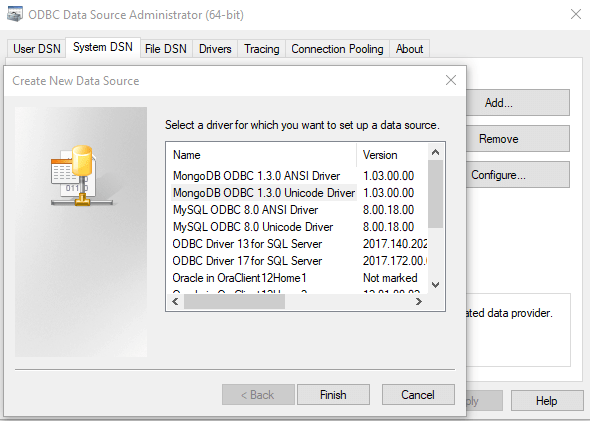
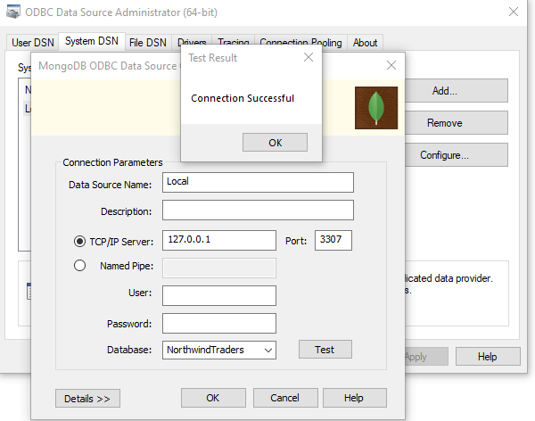
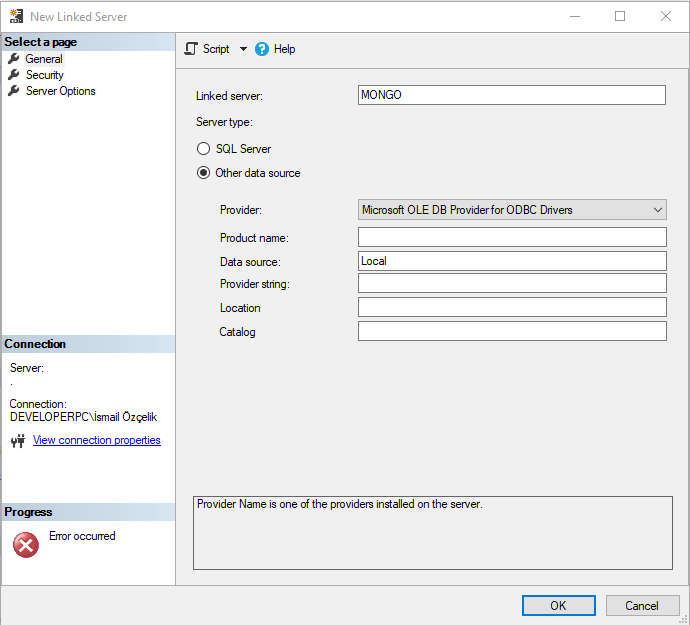

Sql server üzerinden linked server oluşturarak diğer ilişkisel veritabanlarına sorgu atmak uzun zamandır mevcut olan bir özellik. Ancak NoSql veritabanları için ise durum o kadar kolay değildi. Aslında Microsoft Sql Server 2016 ile duyurduğu PolyBase özelliği ile Hadoop ve Azure Blob Storage için bağlantılar kurma özelliğini eklemişti. MongoDB’yi sorgulamak için ise 2019 versiyonunu beklemek gerekecekti.

### Peki ya biz Sql Server 2019’dan önceki versiyonu kullanıyorsak?
Burada çözüm olarak Linked server ile MongoDB veritabanına bağlanmak kalıyor. Bu konuda Türkçe çok fazla kaynak olmadığından dolayı detaylı bir şekilde bu konuyu anlatmaya çalışacağım.

Öncelikle MongoDB sitesinden güncel BI adaptörünü ve Github üzerinden güncel ODBC driverını indirip kuralım.

Kurulumlar bittikten sonra ilk önce indirmiş olduğumuz BI adaptörünü sistemimize Windows Service olarak kuralım. Bunun için yapmamız gereken Converter For BI klasörüne giderek “mongosqld.conf” isimli bir dosya oluşturmak.

```command
C:\Program Files\MongoDB\Connector for BI\[güncel versiyon]\bin
```

 

Bu dosya bize BI connector’un hangi veritabanına bağlanacağını ve diğer ayarlarını yapmamıza imkan veriyor. Oluşturulan dosyasının içerisine aşağıda ki ayarları ekleyelim.

```yaml
systemLog:
  path: 'C:\logs\mongosqld.log'
net:
  bindIp: '127.0.0.1'
  port: 3307
mongodb:
  net:
    uri: "localhost:27017"
schema:
  maxVarcharLength: 8000
```

Burada dikkat edilmesi gerekenler;

1. Sistem logunu yazmak için izin yoksa BI converter başlamayacaktır. Dosya izinlerinden emin olalım.
2. BindIp alanında daha sonra oluşturacağımız DSN’in hangi ip adresinden gelebileceği bilgisi mevcut. Birden fazla adres olabilir ancak server ise localhost’u kullanmayalım onun yerine Ip adresini açıkça yazalım.
3. MaxVarcharLength eklememizin sebebi olası bir hatayı almamak için. (Olası hata: “OLE DB provider “MSDASQL” for linked server “M” returned message “Requested conversion is not supported.”.”)
4. Eğer ilgili sunucuda tek bir veritabanına bağlanmak istiyorsanız şema adının belirtilmesi gerekir.
Şimdi sıra geldi Windows service olarak BI Connector’u başlatmaya. Bunun için aşağıdaki satırlar cmd’de (admin modda) execute edilir.

```command
"C:\Program Files\MongoDB\Connector for BI\2.13\bin\mongosqld.exe" install --config "C:\Program Files\MongoDB\Connector for BI\2.13\bin\mongosqld.conf"
```
Artık BI Connector, Windows service olarak yüklendi. İster cmd’den ister “Services” ekranından başlatabilirsiniz. Cmd için aşağıdaki satırı kullanabilirsiniz.

```command
net start mongosql
```

Bu adımlardan sonra sırada MongoDB için bir tane Data Source Name (DSN) oluşturalım. DSN oluşturmak için “Başlat (Start)” üzerinden ODBC yazabiliriz.


Açılan pencerede “System DSN” sekmesine geçiş yapalım ve açılan pencereden Unicode Driver’ı seçerek “Finish” butonuna basalım.



Daha sonra Configure butonu ile ayarlarımızı yapalım.



Ayarları yaptıktan sonra Test dediğimizde “Connection Successful” görmemiz gerekmekte. Buraya kadar MongoDB için ayarlarımızı yaptık. Şimdi de MSSQL üzerinden Linked Server oluşturma işlemine başlayalım. Bunun için Object Explorer’dan Server Object -> Linked Server seçimlerini yaptıktan sonra yeni bir Linked Server eklemesi yapalım.



Ekleme tamamlandıktan sonra şimdi test etme zamanı. Bir select sorgusu ile mongo veritabanımızdan kayıtları alalım.


Testimiz başarılı oldu. Bundan sonra rahat bir şekilde Mongo veritabanımıza Sql Server üzerinden ulaşabiliriz.

Ek bilgi olarak Mongo veritabanını sorgularken MySql Syntax kullanılamakta.